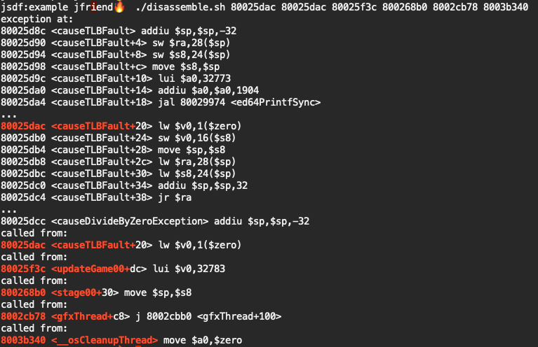

# Example app for ed64log

This is a demo app which shows how to use ed64log in an N64 game. The compiled rom can be found [here](ed64logdemo.zip). The logger initialization code is in [main.c](https://github.com/jsdf/ed64log/blob/master/example/main.c#L15-L18), and game code which demonstrates logging is in [stage00.c](stage00.c). If you press the A or B buttons, text will be logged to ed64log.

## Exception logging and disassembly

If you press the C-left or C-right button the app will intentionally cause an exception and crash, printing debug information to ed64log, eg:

```
Fault in thread 4:

epc   0x80025dac
cause   0x00000010 <Address error on load or instruction fetch>
sr    0x2000ff03 <CU1,IM8,IM7,IM6,IM5,IM4,IM3,IM2,IM1,KER,EXL,IE>
badvaddr  0x00000001

register contents:
at 0xffffffff80050000 v0 0x0000000000000044 v1 0x0000000000000000
a0 0x0000000000000000 a1 0x00000000029ba5fc a2 0x0000000000000000
a3 0x0000000000000000 t0 0x000000000299df6a t1 0x0000000000000220
t2 0x0000000000000000 t3 0x000000000000ff00 t4 0x0000000000000000
t5 0xffffffff8003cf98 t6 0x0000000000000000 t7 0x0000000000000000
s0 0x0000000000000000 s1 0x0000000000000000 s2 0x0000000000000000
s3 0x0000000000000000 s4 0x0000000000000000 s5 0x0000000000000000
s6 0x0000000000000000 s7 0x0000000000000000 t8 0x0000000000000000
t9 0x00000000000fffff gp 0x0000000000000000 sp 0xffffffff800e1b78
ra 0xffffffff80025dac

fpcsr   0x01000804 <FS,EV,FI,RN>
stacktrace:
80025dac 80025dac 80025f3c 800268b0 8002cb78 8003b340 
```

You can then copy the stacktrace list of address (at the bottom), or the program counter (labelled `epc`), and pass it to the `./disassemble.sh` script, eg.:

```bash
./disassemble.sh 80025dac 80025dac 80025f3c 800268b0 8002cb78 8003b340
```

This will output disassembly around the program counter, including the current function name (`updateGame00`):


 
## How to build (macOS or linux):

If you already know how to build N64 roms, this is a standard SDK application using NuSystem, so you can build it in the usual way with `make`.

These are the steps that I use to built it using the N64 SDK installed under Wine:

- Install [wine](https://www.winehq.org/)
- Install the n64 sdk. this repo assumes it's in the default location of `C:\ultra` (in the wine filesystem). If you've installed it somewhere else, you'll need to update this path in `compile.bat`
- Edit `./build.sh` so that WINE_PATH points to your wine binary
- Run `./build.sh`. This should build ed64logdemo.n64
- use `./deploy.sh` to deploy the compiled rom to an Everdrive via USB, and start logging. Requires the ed64log client program (from this repository) and [loader64](https://github.com/jsdf/loader64) to be installed

